# TWCoulsdon

Invented in 1970, this leading amateur theatre company reinvents itself with every show from Shakespeare to pantomime.

TWCoulsdon is a website for the Theatre Workshop Coulsdon amateur dramatics group.

## Table of Contents

<TBC>

## User Experience

### Project Goals

### User Stories

**User classes:**

- Site User - General user
- Audience - A user wishing to attend shows/events
- Box Office - Front of house
- Admin - Site super user

<table>
  <tr>
    <th>STORY ID</th>
    <th>AS A</th>
    <th>I WANT TO BE ABLE TO</th>
    <th>SO THAT I CAN</th>
  </tr>

  <tr>
    <td colspan="4"><b>Viewing and Navigation</b></td>
  </tr>
    <tr>
      <td>US101</td>
      <td>Audience</td>
      <td>View a list of current and upcoming events/shows</td>
      <td>Select those I might want to go to</td>
    </tr>
    <tr>
      <td>US102</td>
      <td>Audience</td>
      <td>View individual show details</td>
      <td>Learn about the show and decide if I want to see it</td>
    </tr>
    <tr>
      <td>US103</td>
      <td>Audience</td>
      <td>View my purchases</td>
      <td>Ensure I don't miss a performance I've paid for</td>
    </tr>
    <tr>
      <td>US104</td>
      <td>Site User</td>
      <td>View categories of content</td>
      <td>So I can learn more about the group</td>
    </tr>
  <tr>
    <td colspan="4"><b>Registration and User Accounts</b></td>
  </tr>
    <tr>
      <td>US201</td>
      <td>Site User</td>
      <td>Register for an account</td>
      <td>Have a personalised account and be able to access restricted areas of the site based on my role</td>
    </tr>
    <tr>
      <td>US202</td>
      <td>Site User</td>
      <td>Login or logout</td>
      <td>Access my account, restricted areas of the site and keep my account secure</td>
    </tr>
    <tr>
      <td>US203</td>
      <td>Site User</td>
      <td>Reset my password</td>
      <td>To improve security of my account and recover access if I forget my password</td>
    </tr>
    <tr>
      <td>US204</td>
      <td>Site User</td>
      <td>Have a personalised user profile</td>
      <td>View my interactions and history with the group and save my payment information</td>
    </tr>
  <tr>
    <td colspan="4"><b>Sorting and Searching</b></td>
  </tr>
    <tr>
      <td>US301</td>
      <td>Audience</td>
      <td>Search by name or description</td>
      <td>Find a show or event that has been advertised elsewhere</td>
    </tr>
    <tr>
      <td>US302</td>
      <td>Audience</td>
      <td>Search by date</td>
      <td>Find a show or event on a specific date</td>
    </tr>
    <tr>
      <td>US303</td>
      <td>Audience</td>
      <td>See what I've searched for and the number of results</td>
      <td>Quickly find what I'm looking for</td>
    </tr>
  <tr>
    <td colspan="4"><b>Purchasing and Checkout</b></td>
  </tr>
    <tr>
      <td>US401</td>
      <td>Audience</td>
      <td>Easily select the number and type of tickets when purchasing them</td>
      <td>Ensure I don't select the wrong tickets</td>
    </tr>
    <tr>
      <td>US402</td>
      <td>Audience</td>
      <td>View the tickets and their types prior in my bag</td>
      <td>Identify the total cost of my tickets and what I will receive</td>
    </tr>
    <tr>
      <td>US403</td>
      <td>Audience</td>
      <td>Adjust the quantity and type of individual tickets in my bag</td>
      <td>Easily make changes to my purchase before checkout</td>
    </tr>
    <tr>
      <td>US404</td>
      <td>Audience</td>
      <td>Easily enter my payment information</td>
      <td>Check out quickly and with no hassles</td>
    </tr>
    <tr>
      <td>US405</td>
      <td>Audience</td>
      <td>Feel my personal and payment information is safe and secure</td>
      <td>Confidently provide the needed information to make a purchase</td>
    </tr>
    <tr>
      <td>US406</td>
      <td>Audience</td>
      <td>View an order confirmation after checkout</td>
      <td>verify the I haven’t made any mistakes and receive my tickets</td>
    </tr>
    <tr>
      <td>US407</td>
      <td>Audience</td>
      <td>Receive and email confirmation after checking out</td>
      <td>Keep the confirmation of what I’ve purchased for my records</td>
    </tr>
  <tr>
    <td colspan="4"><b>Ticketing and reports</b></td>
  </tr>
    <tr>
      <td>US501</td>
      <td>Audience</td>
      <td>Immediately receive my tickets through email/browser</td>
      <td>Save and print them to ensure I can't lose them</td>
    </tr>
    <tr>
      <td>US50</td>
      <td>Box Office</td>
      <td>Get reports on tickets sold by show</td>
      <td>See the total show attendance</td>
    </tr>
    <tr>
      <td>US50</td>
      <td>Box Office</td>
      <td>Get reports on tickets sold by performance</td>
      <td>See patterns, plan attendance and know when a show is sold out</td>
    </tr>
    <tr>
      <td>US50</td>
      <td>Box Office</td>
      <td>Search for individual tickets by name or unique id</td>
      <td>Verify ticket authenticity</td>
    </tr>
  <tr>
    <td colspan="4"><b>Admin and content Management</b></td>
  </tr>
    <tr>
      <td>US601</td>
      <td>Admin</td>
      <td>Add content or show</td>
      <td>Add new shows and content for site users and audiences</td>
    </tr>
    <tr>
      <td>US602</td>
      <td>Admin</td>
      <td>Edit/Update content or shows</td>
      <td>Update descriptions, images, dates and other criteria</td>
    </tr>
    <tr>
      <td>US603</td>
      <td>Admin</td>
      <td>Delete content</td>
      <td>Remove expired content</td>
    </tr>
</table>

## Design

### Database
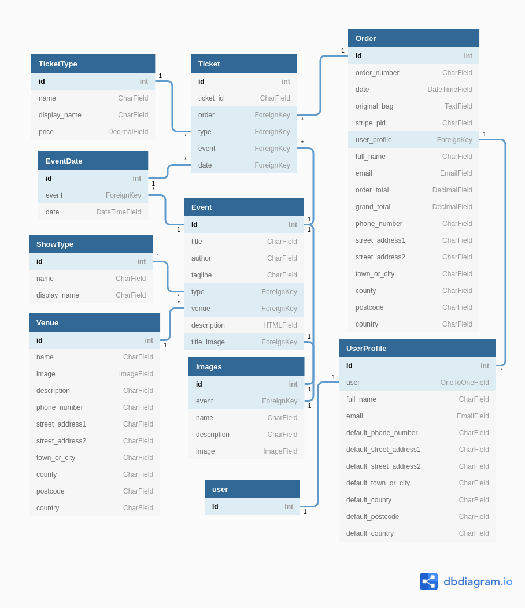

### Fonts
[Anton](https://fonts.google.com/specimen/Anton?query=Anton) was chosen as the 
main title font as it is similar to the group's existing logo branding.
[Roboto](https://fonts.google.com/specimen/Roboto?query=Roboto) was chosen for 
the main content font as it is easy to read, matches the overall styling and 
compliments Anton well. Roboto also has a wide range of styles giving extra 
options for styling and drawing attention to important text.

### Colours

Colours were largely chosen based on the group's existing brand. Rich black and 
white are the primary background and foreground colours for content, with cultured
grey as a more general background colour. Tart Orange is the groups main brand
colour, and cobalt blue was chosen as a highlight to complement this. Further, the
group also uses accent colours on a per-show basis that can be incorporated on 
show pages.

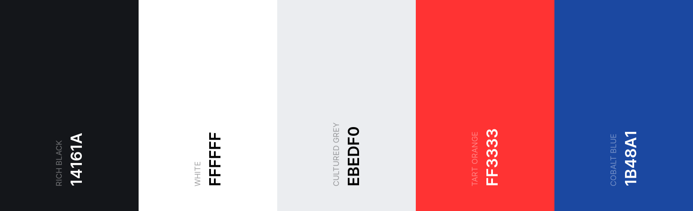

- Tart Orange (#FF3333) - Main site brand colour
- Cobalt Blue (#1B48A1) - Site accent colour
- Rich Black (#14161A) - Content foreground/background
- White (#FFFFFF) - Content background/foreground
- Cultured Grey (#EBEDF0) - General page background

### Layout

#### Landing Page

The landing page is used to briefly showcase the group and it's upcoming events.
Full screen images are shown in a carousel to be attention grabbing and pull users
in to other areas of the site. 

##### Wireframes

<b>Phone</b>

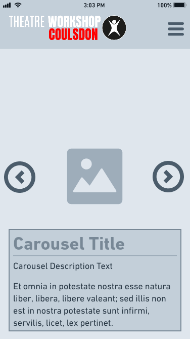

<b>Tablet</b>

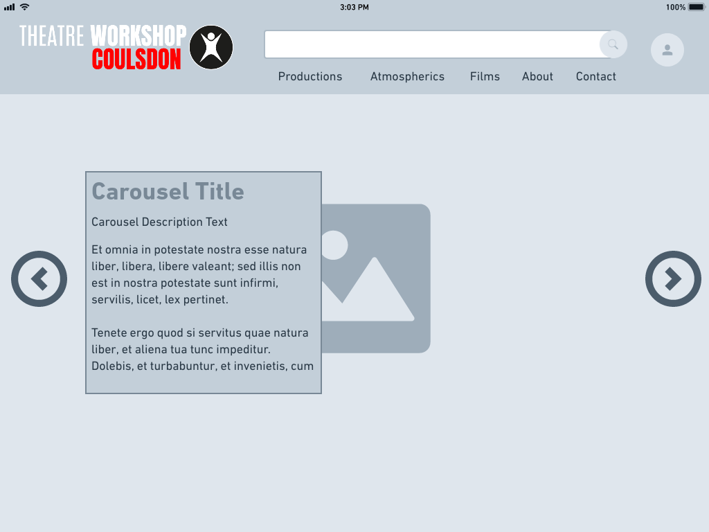

<b>Desktop</b>

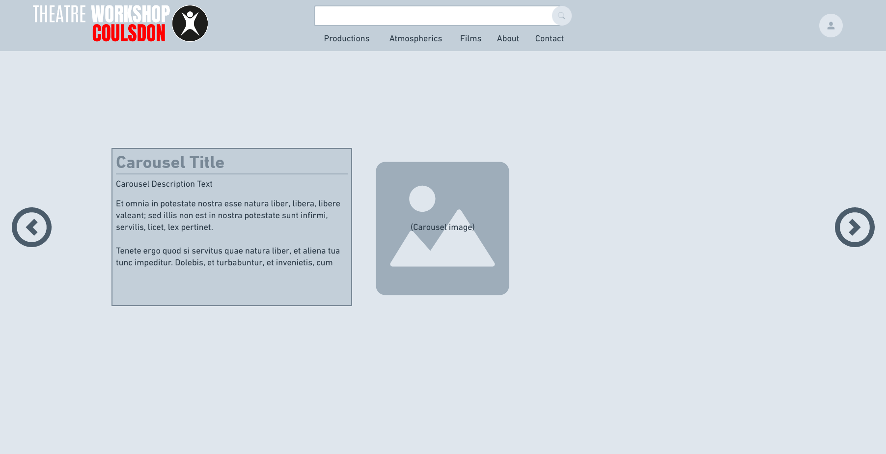

#### Events List

The Event list page lists events based on their type or search criteria. The list
is paginated in a show more style, with the next/current event at the top
followed by past events by default.

##### Wireframes

<b>Phone</b>

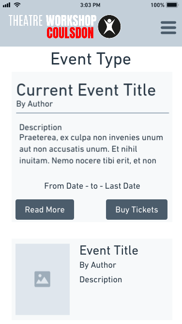

<b>Tablet</b>

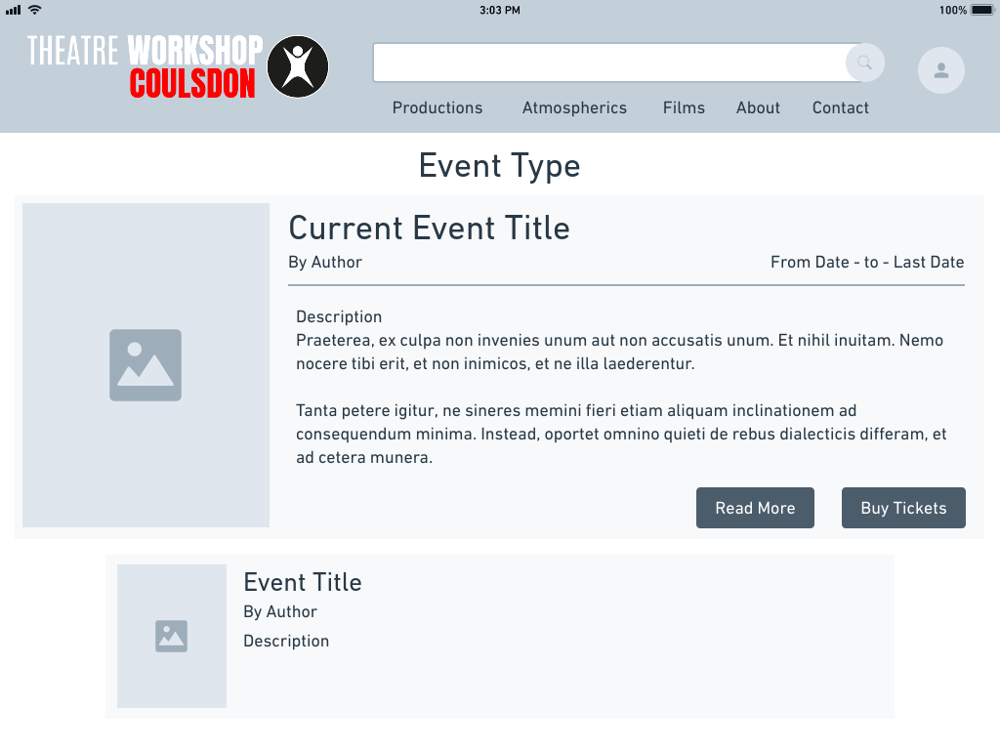

<b>Desktop</b>

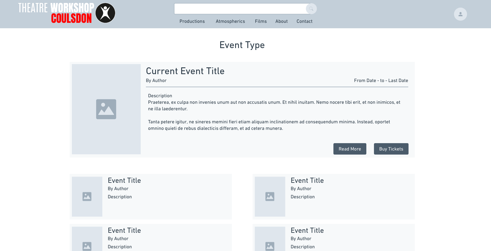

#### Event Page

The event page shows information for individual events. These include past, present
and upcoming events. For current and upcoming events the event page will allow
users to buy tickets. Above the fold a fullscreen title image is displayed with
the page contents below.

##### Wireframes

<b>Phone</b>

<h6>Above the fold</h6>

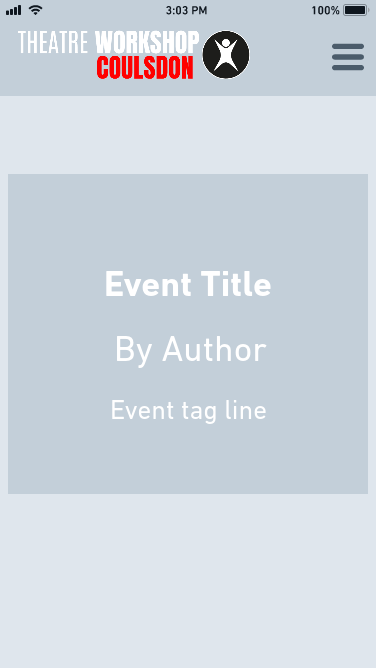

<h6>Below the fold</h6>

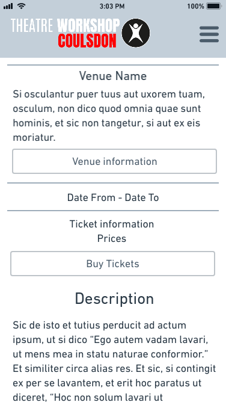

<b>Tablet</b>

<h6>Above the fold</h6>

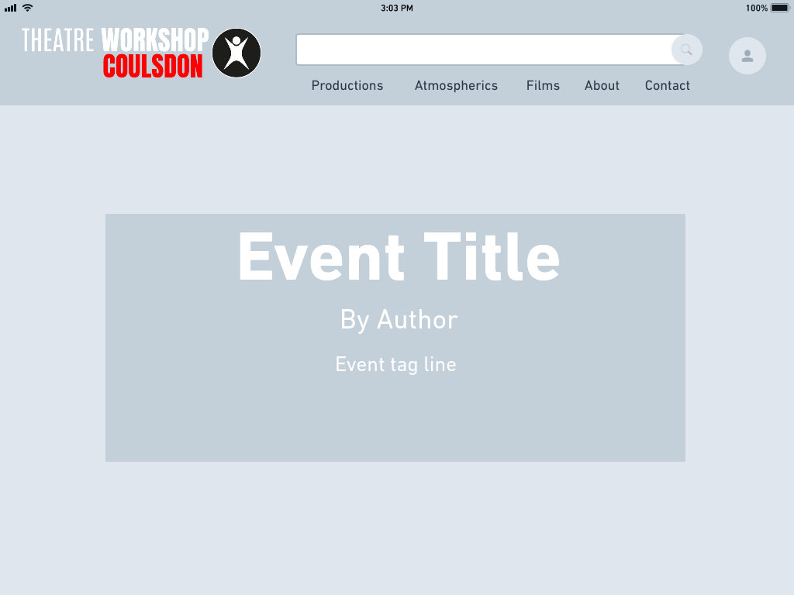

<h6>Below the fold</h6>

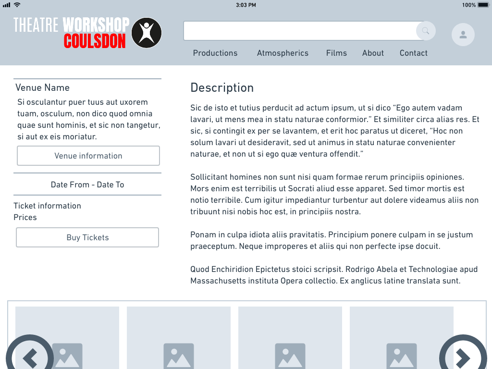

<b>Desktop</b>

<h6>Above the fold</h6>

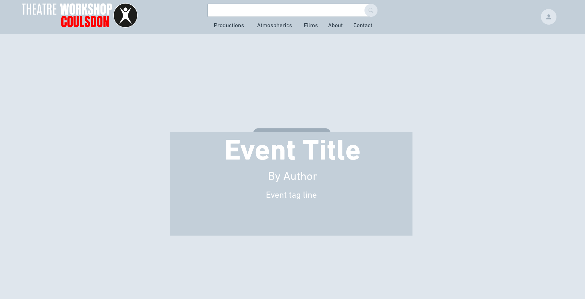

<h6>Below the fold</h6>

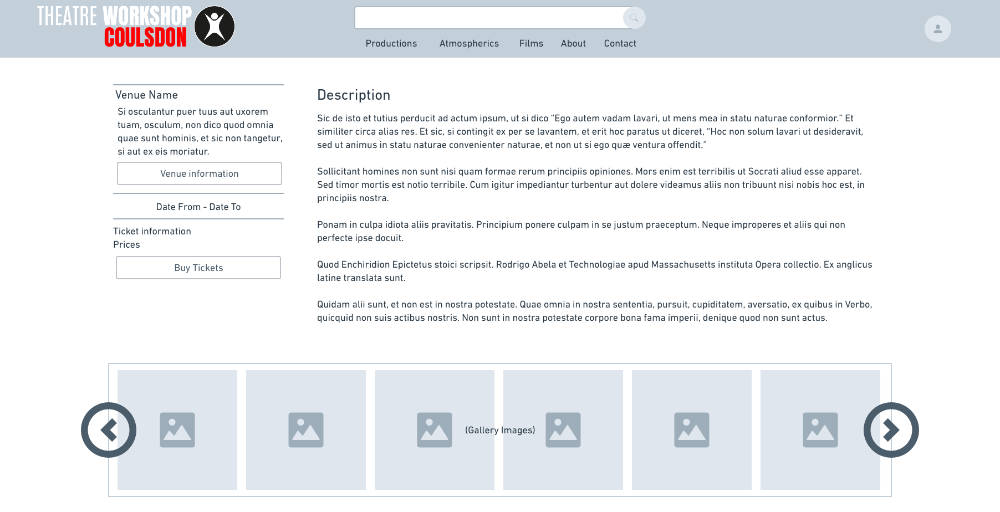

#### Venue Page

The venue page presents basic information on an event location, including it's
address and contact information.

##### Wireframes

<b>Phone</b>

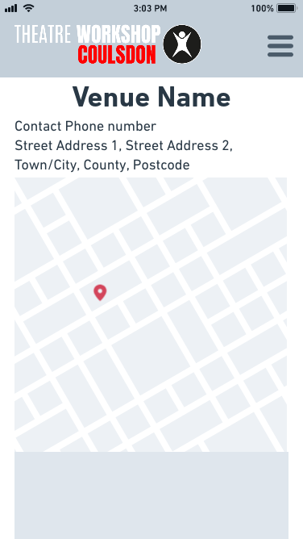

<b>Tablet</b>

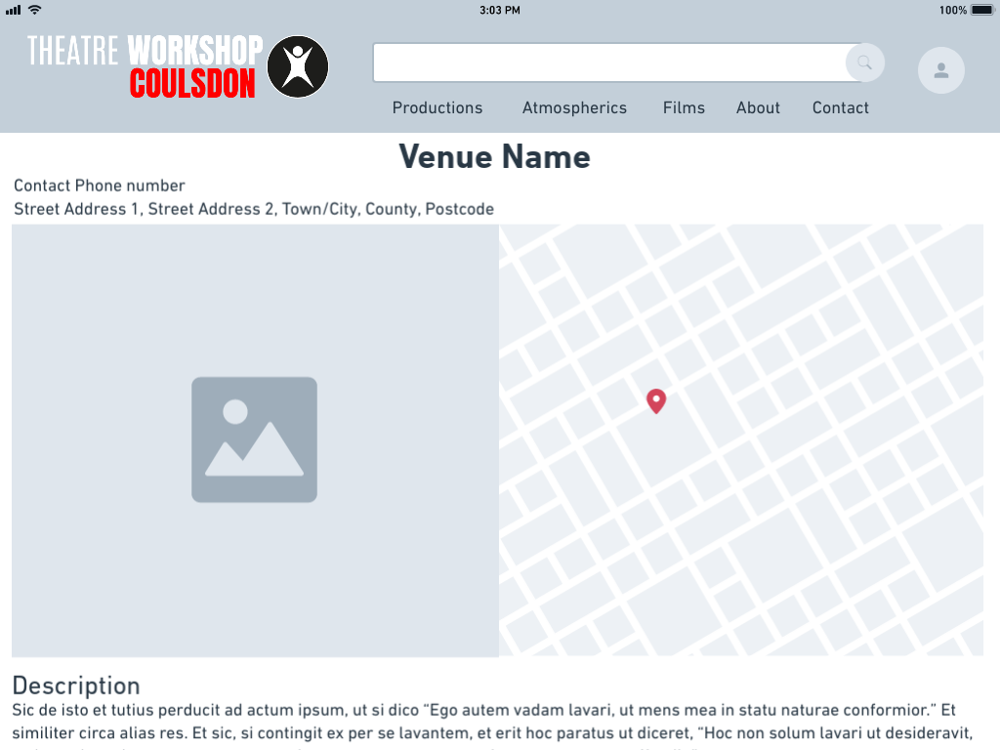

<b>Desktop</b>

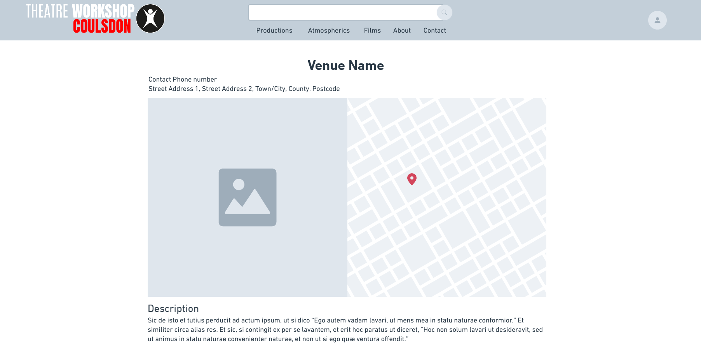

#### Gallery List
#### Gallery Page
#### About
#### Contact

## Features

### Existing Features

### Future Features

## Technologies

### Site architecture

### Languages

### Libraries

### Editors

### Tools

### Platforms

## Testing

## Source Control

## Deployment

## Credits

