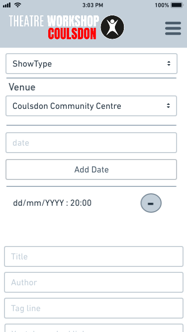
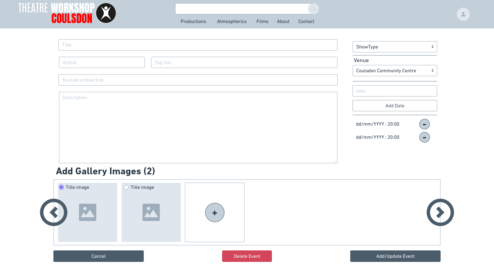
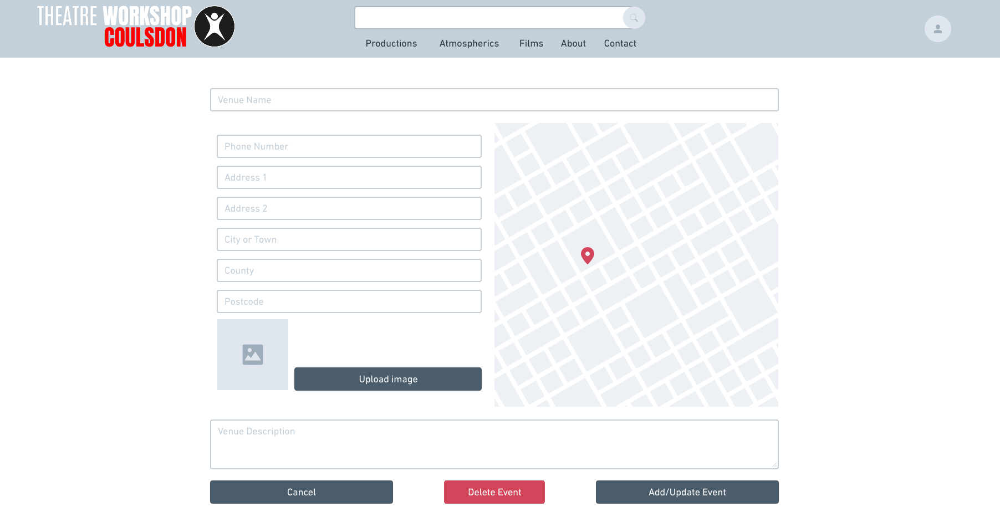

# TWCoulsdon

Invented in 1970, this leading amateur theatre company reinvents itself with every
show from Shakespeare to pantomime.

TWCoulsdon is a website for the Theatre Workshop Coulsdon amateur dramatics group,
intended to replace the group's [current online presence](https://twcoulsdon.org.uk/)
with a new modern web application. It also aims to reduce the groups reliance on
third-party ticketing platforms by moving online ticket sales in-house. This
should give a more seamless end-user experience, while also improving the efficiency
of the box-office and reporting.

[](LICENSE)

## Table of Contents

<TBC>

## User Experience

### Project Goals

### User Stories

**User classes:**

- Site User - General user
- Audience - A user wishing to attend shows/events
- Box Office - Front of house
- Admin - Site super user

<table>
  <tr>
    <th>STORY ID</th>
    <th>AS A</th>
    <th>I WANT TO BE ABLE TO</th>
    <th>SO THAT I CAN</th>
  </tr>

  <tr>
    <td colspan="4"><b>Viewing and Navigation</b></td>
  </tr>
    <tr>
      <td>US101</td>
      <td>Audience</td>
      <td>View a list of current and upcoming events/shows</td>
      <td>Select those I might want to go to</td>
    </tr>
    <tr>
      <td>US102</td>
      <td>Audience</td>
      <td>View individual show details</td>
      <td>Learn about the show and decide if I want to see it</td>
    </tr>
    <tr>
      <td>US103</td>
      <td>Audience</td>
      <td>View my purchases</td>
      <td>Ensure I don't miss a performance I've paid for</td>
    </tr>
    <tr>
      <td>US104</td>
      <td>Site User</td>
      <td>View categories of content</td>
      <td>So I can learn more about the group</td>
    </tr>
  <tr>
    <td colspan="4"><b>Registration and User Accounts</b></td>
  </tr>
    <tr>
      <td>US201</td>
      <td>Site User</td>
      <td>Register for an account</td>
      <td>Have a personalised account and be able to access restricted areas of the site based on my role</td>
    </tr>
    <tr>
      <td>US202</td>
      <td>Site User</td>
      <td>Login or logout</td>
      <td>Access my account, restricted areas of the site and keep my account secure</td>
    </tr>
    <tr>
      <td>US203</td>
      <td>Site User</td>
      <td>Reset my password</td>
      <td>To improve security of my account and recover access if I forget my password</td>
    </tr>
    <tr>
      <td>US204</td>
      <td>Site User</td>
      <td>Have a personalised user profile</td>
      <td>View my interactions and history with the group and save my payment information</td>
    </tr>
  <tr>
    <td colspan="4"><b>Sorting and Searching</b></td>
  </tr>
    <tr>
      <td>US301</td>
      <td>Audience</td>
      <td>Search by name or description</td>
      <td>Find a show or event that has been advertised elsewhere</td>
    </tr>
    <tr>
      <td>US302</td>
      <td>Audience</td>
      <td>Search by date</td>
      <td>Find a show or event occurring within a range of dates</td>
    </tr>
    <tr>
      <td>US303</td>
      <td>Audience</td>
      <td>See what I've searched for and the number of results</td>
      <td>Quickly find what I'm looking for</td>
    </tr>
  <tr>
    <td colspan="4"><b>Purchasing and Checkout</b></td>
  </tr>
    <tr>
      <td>US401</td>
      <td>Audience</td>
      <td>Easily select the number and type of tickets when purchasing them</td>
      <td>Ensure I don't select the wrong tickets</td>
    </tr>
    <tr>
      <td>US402</td>
      <td>Audience</td>
      <td>View the tickets and their types prior to checkout in my basket</td>
      <td>Identify the total cost of my tickets and what I will receive</td>
    </tr>
    <tr>
      <td>US403</td>
      <td>Audience</td>
      <td>Adjust the quantity and type of individual tickets in my basket</td>
      <td>Easily make changes to my purchase before checkout</td>
    </tr>
    <tr>
      <td>US404</td>
      <td>Audience</td>
      <td>Easily enter my payment information</td>
      <td>Check out quickly and with no hassles</td>
    </tr>
    <tr>
      <td>US405</td>
      <td>Audience</td>
      <td>Feel my personal and payment information is safe and secure</td>
      <td>Confidently provide the needed information to make a purchase</td>
    </tr>
    <tr>
      <td>US406</td>
      <td>Audience</td>
      <td>View an order confirmation after checkout</td>
      <td>verify the I haven’t made any mistakes and receive my tickets</td>
    </tr>
    <tr>
      <td>US407</td>
      <td>Audience</td>
      <td>Receive and email confirmation after checking out</td>
      <td>Keep the confirmation of what I’ve purchased for my records</td>
    </tr>
  <tr>
    <td colspan="4"><b>Ticketing and reports</b></td>
  </tr>
    <tr>
      <td>US501</td>
      <td>Audience</td>
      <td>Immediately receive my tickets through email/browser</td>
      <td>Save and print them to ensure I can't lose them</td>
    </tr>
    <tr>
      <td>US502</td>
      <td>Box Office</td>
      <td>Get reports on tickets sold by show</td>
      <td>See the total show attendance</td>
    </tr>
    <tr>
      <td>US503</td>
      <td>Box Office</td>
      <td>Get reports on tickets sold by performance</td>
      <td>See patterns, plan attendance and know when a show is sold out</td>
    </tr>
    <tr>
      <td>US504</td>
      <td>Box Office</td>
      <td>Search for individual tickets by name or unique id</td>
      <td>Verify ticket authenticity</td>
    </tr>
  <tr>
    <td colspan="4"><b>Admin and content Management</b></td>
  </tr>
    <tr>
      <td>US601</td>
      <td>Admin</td>
      <td>Add content or show</td>
      <td>Add new shows and content for site users and audiences</td>
    </tr>
    <tr>
      <td>US602</td>
      <td>Admin</td>
      <td>Edit/Update content or shows</td>
      <td>Update descriptions, images, dates and other criteria</td>
    </tr>
    <tr>
      <td>US603</td>
      <td>Admin</td>
      <td>Delete content</td>
      <td>Remove expired content</td>
    </tr>
</table>

## Design

### Database


<details>
<summary><b>Django Models</b></summary>
Render of django's models:


</details>

### Fonts
[Anton](https://fonts.google.com/specimen/Anton?query=Anton) was chosen as the
main title font as it is similar to the group's existing logo branding.
[Roboto](https://fonts.google.com/specimen/Roboto?query=Roboto) was chosen for
the main content font as it is easy to read, matches the overall styling and
compliments Anton well. Roboto also has a wide range of styles giving extra
options for styling and drawing attention to important text.

### Colours

Colours were largely chosen based on the group's existing brand. Rich black and
white are the primary background and foreground colours for content, with cultured
grey as a more general background colour. Tart Orange is the groups main brand
colour, and cobalt blue was chosen as a highlight to complement this. Further, the
group also uses accent colours on a per-show basis that can be incorporated on
show pages.


- Tart Orange (#FF3333) - Main site brand colour
- Cobalt Blue (#1B48A1) - Site accent colour
- Rich Black (#14161A) - Content foreground/background
- White (#FFFFFF) - Content background/foreground
- Cultured Grey (#EBEDF0) - General page background

### Layout

The group's current online presence can be seen [here](https://twcoulsdon.org.uk/).
The current site is implemented in wordpress and uses a third party website for ticketing.
Members have voiced a number of issues with the current site:
- Lack of control over styling of new pages.
  - Further, the generated pages look significantly different to what appears during editing making it difficult to get the look required.
- The third party ticketing website requires redirecting to a third party.
  - Boxoffice is displeased with the reporting options available from the ticketing site.
  - Boxoffice are unable to style tickets.
- In general the styling of the site is starting to become dated, and lacks the dynamic elements that are becoming standard with HTML5.

The source files for the wireframes can be found [here](https://whimsical.com/twcoulsdon-MnWUe2AJ69HJn9choBeiNd).


#### Landing Page

The landing page is used to briefly showcase the group and it's upcoming events.
Full screen images are shown in a carousel to be attention grabbing and pull users
in to other areas of the site.

##### Wireframes
<details>
<summary><b>Phone</b></summary>


</details>

<details>
<summary><b>Tablet</b></summary>


</details>

<details>
<summary><b>Desktop</b></summary>


</details>

#### Events List

The Event list page lists events based on their type or search criteria. The list
is paginated in a show more style, with the next/current event at the top
followed by past events by default.

##### Wireframes

<details>
<summary><b>Phone</b></summary>


</details>

<details>
<summary><b>Tablet</b></summary>


</details>

<details>
<summary><b>Desktop</b></summary>


</details>

#### Event Page

The event page shows information for individual events. These include past, present
and upcoming events. For current and upcoming events the event page will allow
users to buy tickets. Above the fold a fullscreen title image is displayed with
the page contents below.

##### Wireframes

<details>
<summary><b>Phone</b></summary>

<h6>Above the fold</h6>


<h6>Below the fold</h6>


</details>

<details>
<summary><b>Tablet</b></summary>

<h6>Above the fold</h6>


<h6>Below the fold</h6>


</details>

<details>
<summary><b>Desktop</b></summary>

<h6>Above the fold</h6>


<h6>Below the fold</h6>


</details>

#### Add/Edit Event Page

The Add/Edit event page allows adding new events and editing existing ones,
including the related models such as dates and images.

##### Wireframes

<details>
<summary><b>Phone</b></summary>




</details>

<details>
<summary><b>Tablet</b></summary>


</details>

<details>
<summary><b>Desktop</b></summary>




</details>

#### Venue Page

The venue page presents basic information on an event location, including it's
address and contact information.

##### Wireframes

<details>
<summary><b>Phone</b></summary>


</details>

<details>
<summary><b>Tablet</b></summary>


</details>

<details>
<summary><b>Desktop</b></summary>


</details>

#### Add/Edit Venue Page

The venue page presents basic information on an event location, including it's
address and contact information.

##### Wireframes

<details>
<summary><b>Phone</b></summary>


</details>

<details>
<summary><b>Tablet</b></summary>


</details>

<details>
<summary><b>Desktop</b></summary>



</details>

#### Delete Event/Venue Modal

Not currently implemented.

Helps to ensure events and venues are not deleted accidentally.

<details>
<summary><b>Phone</b></summary>


</details>

<details>
<summary><b>Desktop</b></summary>


</details>

##### Wireframes


#### Information Pages

Various pages providing information on the group. May be expanded to also provide blog like functionality if required later.

##### Wireframes

<details>
<summary><b>Phone</b></summary>


</details>

<details>
<summary><b>Tablet</b></summary>


</details>

<details>
<summary><b>Desktop</b></summary>


</details>

#### Add Tickets Modal

Tickets are added through a modal dialogue that allows adding multiple tickets of
different types and dates for a single event to the basket.

##### Wireframes

<details>
<summary><b>Phone</b></summary>


</details>

<details>
<summary><b>Tablet</b></summary>


</details>

<details>
<summary><b>Desktop</b></summary>


</details>

#### Basket

The basket page gives access to the currently selected tickets before purchase
and provides tools to edit items and quantities.

##### Wireframes

<details>
<summary><b>Phone</b></summary>


</details>

<details>
<summary><b>Tablet</b></summary>


</details>

<details>
<summary><b>Desktop</b></summary>


</details>

#### Checkout

The checkout page gives a summary of the current basket contents and offers links back to the basket for editing. The payment form allows the user to add their details and complete secure checkout.

##### Wireframes

<details>
<summary><b>Phone</b></summary>


</details>

<details>
<summary><b>Tablet</b></summary>


</details>

<details>
<summary><b>Desktop</b></summary>


</details>

#### Checkout Complete

The checkout complete page confirms to the user that checkout has completed, provides a summary of their order and provides links to their e-tickets.

##### Wireframes

<details>
<summary><b>Phone</b></summary>


</details>

<details>
<summary><b>Tablet</b></summary>


</details>

<details>
<summary><b>Desktop</b></summary>


</details>

#### Ticket Validation

The ticket validation is a simple report to confirm a ticket's face value conforms
to the information held on the database. The check order button will only be available
logged in staff members.

##### Wireframes

<details>
<summary><b>Phone</b></summary>


</details>

<details>
<summary><b>Tablet</b></summary>


</details>

<details>
<summary><b>Desktop</b></summary>


</details>

<details>
<summary><b>Expired tickets</b></summary>


</details>

<details>
<summary><b>E-Ticket Layout</b></summary>


</details>

## Features

The site allows admin users to add, edit, and delete events and their associated items (gallery images and performance dates). It provides normal users with the functionality to search events. They can add tickets for future performance dates that still have available tickets to a shopping basket. Tickets in the basket can then be bought through a secure payment system backed by stripe. Once payment is confirmed tickets are removed from availability and created in the database. Successful checkout will generate a pdf file with visual representation of a user's e-tickets that will be emailed to them and presented as a link for download. The e-tickets are given a QR-code with a link to a validation URL to help in front of house ticket validation.

### Existing Features

#### Viewing and navigation

- (US101): Upcoming events are showcased in a list of full-width banners
- (US102): Each event has a details page with detailed show information
- (US103): Logged in users can view their previous orders from their profile
  - An order confirmation and copy of e-ticket pdf is emailed to the order email after checkout
- (US104): Events can be filtered and searched by date range and type

#### Registration and User Accounts

- US201: Users can register accounts through allauth
  - The site restricts information shown to users based on whether they are unregistered, registered, staff, or admin
  - Some site routes block access to non-admin/site-staff users
- US202: The site uses django and allauth secure logins and access restrictions
  - The site enforces the use of HTTPS to ensure user communications and data are transmitted securely
  - Passwords are stored in hashed form so can't be stolen even if the website were to be hacked
- (US203): Allauth offers password resetting routes and links
- (US204): Users have a personal user profile which can store some basic checkout information and provides links to their past orders

#### Sorting and Searching

- (US301): Events can be searched by text in the title and description from the search bar
- (US302): Events can be searched and filtered by date ranges
- (US303): Searches are displayed in a paginated list

#### Purchasing and Checkout

- (US401): When selecting tickets the user is presented with a dialog that allows them to choose tickets by event date and ticket type. Ticket quantity can be adjusted before adding to the basket
- (US402): The basket lists all the tickets current queued for purchase by date and type with their quantity
- (US403): Tickets in the basket can have their quantity increased or decreased or deleted entirely
  - To ensure these action are purposeful:
    - Increasing the quantity requires also pressing an update button
    - Update and delete buttons are separated in the UI to prevent hitting the wrong one
- (US404): On checkout a simple validated form is presented for the user to input their personal and payment information
- (US405): Checkout is supported by the secure stripe payment platform
- (US406): After checkout a success page is presented, giving the user details of their order and a link to their e-ticket pdf
- (US407): After checkout an email is generated with the order information and an attached ticket pdf

#### Ticketing and Reports

- (US501): After checkout an email is generated with the order information and an attached ticket pdf
- (US504): Tickets have a validation link that retrieves their database information so it can be verified
  - The e-ticket has a QR-code that allows automatic searching

#### Admin and content Management

- (US600): Admin users have extra options in their user context menu:
  - Add event (shown on every page) - links to add event page
  - Edit event (shown on an event detail page) - links to edit event page
- (US601): Admin users can add new events through the front end
  - The event details page presents
- (US602): Admin users can edit existing events through the front end
  - The gallery widget presents admin users with extra options to upload new images, edit exiting images meta data, and set a gallery image as the event title image
- (US603): Admin users can delete events from the edit event page
  - To ensure events aren't deleted accidentally:
    - event deletion is only available from edit event page
    - When the delete button is pressed a modal is shown asking the user to confirm

### Future Features

#### Ticketing and reports

- (US502): Ticket back-end reporting is not yet implemented

  Planned features:
  - Ticket filtering by individual events, with type and sorted by date
  - Provided on-line or as CSV download


- (US503): Ticket back-end reporting is not yet implemented

  Planned features:
  - Ticket filtering by event date
  - Provided on-line or as CSV download


- (US504): Ticket searching not fully implemented

  Planned features:
  - Searching through the website for tickets based on:
    - Order no.
    - Ticket ID.
    - Customer name

#### Admin and content Management

- (US601): Planned feature: Adding venues through a front end route. Currently only possible through the admin panel.
- (US602): Planned feature: Editing venues through a front end route. Currently only possible through the admin panel.
- (US603): Planned feature: Deleting venues through a front end route. Currently only possible through the admin panel.

### Defensive programming

- Bad data:
  - Post and Get requests that require data use if statements and exception logic to ensure bad data is caught and dealt with without causing 500 errors or damaging database data
  - Error messages are sent to the user alerting them to a faulty submission
  - Untrusted users are restricted from what they can access and what data they can send to the server


- Unauthorised access:
  - In the front-end users are only presented with links they are authorised to access
  - The back-end blocks access to unauthorised users through function decorators
  - For softer restrictions, like preventing checkout without an active basket:
    - Requests are redirected and users given an error message
  - When unauthorised users try to access restricted content:
    - Users are either redirected to unrestricted


- Users:
  - Unregistered users are always untrusted
  - Registered users default to untrusted
  - Registered users are trusted if they are staff or superuser


- Untrusted users:
  - If unregistered they can buy tickets and checkout with data input at checkout
  - If registered they can also access a basic profile page of their details and previous orders


- Trusted users:
  - Are given access to restricted areas such as the admin panel and front end content editing
  - Are able to upload rich text (HTML content)
    - This is a potential vector for attack, as HTML content has minimal sanitisation. It would be possible to use injection attacks here. This is not considered a security risk because these pathways are blocked to untrusted users, on the principle that you either trust your trusted users, or you don't make them trusted users.
    - **NOTE**: If rich text input is added for untrusted users (for say, reviews/comments) trusted user code should **not** be reused.


## Technologies

### Site architecture

#### Core app

The core app defines a few basic functions and models used throughout the site
that don't fit anywhere else.

#### Home app

Provides models and views for the landing and group information pages.

* Landing page
* About page
* Contact page

#### Events app

Provides models and pages for event and venue information

* Events list
* Event page
* Venue page

#### Profiles app

Provides models and pages for user information and profiles.

* User profile page

#### Box Office app

Provides models and pages for buying tickets, checking their validity and generating show attendance reports.

* Shopping basket
* Checkout
* Show attendance and ticketing reports

### Potential improvements

Some potential improvements to the site code design and architecture have been identified:

##### CSS
CSS files are somewhat split by app/page so styles not needed by other pages aren't loaded. This isn't complete though, with some styles that are app or page specific remaining in base.css. These should be further split out to separate page/app styles sheets.

There is also scope for improving the existing styles. In some circumstances styles could be combined, in others split out to more general classes to be applied in html. This process has been started but not completed before deadline.

#### Box Office app

Currently ticketing, basket and checkout functionality is provided by the boxoffice app. Although these are related and somewhat closely coupled functions, they have become complex and complete enough to warrant separating into their own apps. A future architectural improvement would be to separate these roles into the following apps:
- Boxoffice
  - Admin and reporting for boxoffice and front of house
  - Stock keeping: tools for ensuring tickets are available
  - Ticket generation.
- Basket
  - Shopping basket functionality
- Checkout
  - Secure payments and checkout

Additionally:
- The boxoffice app implements emailing, mainly used for checkout confirmation. The core app may be a better place for this if emailing is used more generally (say for mailing lists when new events are added).

#### Event Editing

Adding or Editing events is currently done asynchronously through JavaScript. This reflects an earlier architecture where images were added in the edit page along with event data. This turned out to be too complex, so image editing was moved to the event details page, where it can be done on one image at a time for existing events. Now that image upload is being handled elsewhere events can be submitted through a standard form submit, which would significantly simplify the front and back end code and provide a better user experience.

Conversely, adding/editing asynchronously allows the user to remain on the edit page if there are issues with the submission. However, redirecting and giving form defaults may be a simpler and more performant option here.

#### Object Orientation

The project currently uses object orientated paradigms to promote encapsulation and code reuse. For instance by use custom exceptions and inheritance to reuse slug generation code in models. There is a lot of scope to expand this to improve encapsulation and code reuse site wide. For instance the basket is managed through a series of helper functions. This is a prime candidate for being turned into a class to encapsulate basket functionality in an object. This would remove the need for converting to and from json representations at various points in the code, aide in error handling and simplify imports in client code.

### Languages
- [HTML5](https://developer.mozilla.org/en-US/docs/Web/Guide/HTML/HTML5)
  - Used as the markup language for the site layout.
- [CSS3](https://developer.mozilla.org/en-US/docs/Web/CSS)
  - Used to style and colour HTML and dynamic elements.
  - CSS2 is used for generating pdf files.
- [JavaScript](https://developer.mozilla.org/en-US/docs/Web/JavaScript)
  - Used to create and manipulate the site's client-side dynamic elements. Also
  performs AJAX requests for client/server communication.
- [Python](https://www.python.org/)
  - Used for the backend server and running queries to the database.
- [Django Templating Language](https://docs.djangoproject.com/en/3.2/ref/templates/language/)
  - Used to generate HTML from site templates
- [SVG](https://developer.mozilla.org/en-US/docs/Glossary/SVG)
  - Used to define a number of the sites icons and graphical elements.
  - Also used for the site favicon where supported. This allows infinite scalability
  and the use of advanced features, such as automatically changing colours based
  on user theme:
  - 

### Database
- [PostgreSQL](https://www.postgresql.org/)
  - Used for storing data for the live site.
- [SQLite3](https://www.sqlite.org/index.html)
  - Used for development on local hosting.

### Libraries
- [Django](https://www.djangoproject.com/)
  - The project uses the django web framework to support advanced web server task.
- [JQuery](https://jquery.com)
  - The project uses JQuery to simplify DOM manipulation.
- [Bootstrap](https://getbootstrap.com/)
  - The project uses Bootstrap to aid in responsive design and to provide a number
  of frontend components.
- [Easy Thumbnails](https://pypi.org/project/easy-thumbnails/)
  - Easy Thumbnails is used to automatically generate thumbnails for gallery image.
- [Segno](https://pypi.org/project/segno/)
  - Segno is used to generate QR Codes for ticket validation.
- [django-embed-video](https://pypi.org/project/django-embed-video/)
  - Used to simplify youtube video embedding within django templates.
- [Tinymce](https://www.tiny.cloud/)
  - Used to provide rich text input.
- [WeasyPrint](https://weasyprint.org/)
  - Used to generate pdf files from Django html templates for tickets and reporting.

### Editors
- [Atom](https://atom.io/)
  - Atom was used to write HTML/CSS, Javascript and Python code. It was also use
  to build the readme and testing markdown documentation.
- [dbdiagram](https://dbdiagram.io/home)
  - Used to create Entity Relationship Diagrams of the database.
- [Adobe Photoshop](https://www.adobe.com/products/photoshop.html)
  - Used to create some of the image files used on the site.
- [Adobe Illustrator](https://www.adobe.com/products/illustrator.html)
  - Used to create some of the images and icons used on the site.
- [Inkscape](https://inkscape.org/)
  - Used to produce some svg images and icons.
- [whimsical](https://whimsical.com/)
  - Used to produce the projects wireframes.

### Tools
- [Git](https://git-scm.com/)
  - Used for version control and synchronising local and remote repositories.
- [Coolors](https://coolors.co/)
  - Used to help define the site colour scheme.
- [Autoprefixer](https://autoprefixer.github.io/)
  - Used to ensure backwards CSS compatibility with legacy browsers.

### Platforms
- [Heroku](https://www.heroku.com/platform)
  - The project uses Heroku as it's deployment platform.
- [Amazon S3](https://aws.amazon.com/free/)
  - Used to store site static and media files.
- [Youtube](https://www.youtube.com/)
  - Used for video content.
- [Github](https://github.com/)
  - Used for source control.

## Testing
Information on testing can be found in [TESTING.md](TESTING.md)

## Source Control
The website was developed using the Atom editor with git and github for version control.

New changes to the local copy can be added to the remote repository by first adding:

`git add .`

Committing the changes to local version control:

`git commit -m "<commit message>"`

And pushing them to the remote repository:

`git push`

### Branches

Branches were used to add and develop new features for testing without affecting the main branch and deployed application.

#### Creating a branch

A branch can be created and selected in one operation with:

`git checkout -b <branch name>`

#### Selecting a branch

Switching to an already created branch can be done by:

`git checkout <branch name>`

#### Merging a branch

For merging the commits of one branch to another (for instance when merging a completed development branch to main):

1. Checkout branch to merge into:

   `git checkout <destination branch>`

2. Merge source branch into destination:

   `git merge <source branch>`

#### Deleting a branch

1. Ensure you are not on the branch you want to delete by selecting another

2. Delete the branch locally:

  `git branch - <local branch name>`

3. Delete the branch remotely:

  `git push origin --delete <remote branch name>`

## Deployment

### Database Deployment

Django will do most of the work of preparing and setting up the database through
'migrations'.

To update the database to the latest models, from the project root:
1. First generate the python migration scripts:

  `python3 manage.py makemigrations`

2. Then run the scripts and update the database:

  `python3 manage.py migrate`

### Local Deployment

To deploy the project locally first clone the github repository to a local directory:

- Navigate to the project's github repository (https://github.com/seanyoung247/TWCoulsdon)
- Select the "Code" button above the file listing
  - Select download Zip
- unzip the file to a local directory

#### Python Environment

After cloning the repository the python environment needs to be set up. Ensure python3 is installed and is version 3.8.6 minimum with the command:
`python3 --version`

You will then need to create a virtual environment:
From the projects local root directory run the following command:

`python3 -m venv .`

To activate the virtual environment use the command:

`source bin/activate`

Once the virtual environment is activated the project's python prerequists can be installed with:

`pip3 install -r requirements.txt`

Database migrations should now be run as outlined above.

Once finished working, or if the virtual environment needs to be restarted (for instance if environment varibles have change and need to be reloaded) deactivate by typing:

`deactivate`

#### Environment Variables

The project is configured through various environment variables.

Required variables:

- SECRET_KEY
  - Defines the Django secret key. A helper script has been provided to generate new keys, and can be run by running: `python3 gen_secret_key.py` from the project root.

Optional variables:

- RESULTS_PER_PAGE
  - Defines how many search results should be returned. Ideally multiples of 6, defaults to 12 if not supplied.


- TICKET_CUT_OFF_HOURS
  - How many hours before a performance that tickets will stop being sold. Defaults to 2

Testing variables (should not be set in production):

- DEFAULT_FROM_EMAIL
  - Defines a test email account


- DEVELOPMENT
  - If set puts the project into debug mode.


- TEST_IP
  - Should be set to the IP address of the testing machine. When the server is run with the command: `python3 manage.py runserver 0:8000` other devices on the local network will be able to connect to the site via this address for testing.

Deployment variables:

- EMAIL_HOST
  - The smtp address of the email service provider


- EMAIL_HOST_USER
  - Email username


- EMAIL_HOST_PASS
  - Email password


- DATABASE_URL
  - The URL of the remote database

- USE_AWS
  - If set the project will attempt to use Amazon S3 for static and media file storage.

If using Amazon S3 the following variables will need to be set:
- AWS_ACCESS_KEY_ID
- AWS_SECRET_ACCESS_KEY
- AWS_STORAGE_BUCKET_NAME
- AWS_S3_REGION_NAME

Stripe payments variables:
- STRIPE_PUBLIC_KEY
- STRIPE_SECRET_KEY
- STRIPE_WH_SECRET

The suggested method for defining environment variables for local development is with a shell script. Variables can be set with the export command:
`export <key>=<value>` and unset with: `unset <key>`. This can be done automatically when activating and deactivating the python virtual environment. The environment variables can be set within a script with the following template:
```
env_start() {
  <exports here>
}
env_stop() {
  <unsets here>
}
```
Saved to the project root with the filename .env. This can be added to the virtual environment activation by adding the following code to bin/activate:
```
. .env

deactivate () {

...

    # Unset environment
    env_stop
}

...

# Set environment variables
env_start
```

### e-commerce

The project includes e-commerce functionality provided by stripe. If running in a local host further setup will be needed to enable testing of webhooks:

First, install the latest version of stripe CLI for your environment from https://github.com/stripe/stripe-cli/releases/latest.

- Link your stripe account:
  - In the terminal type `stripe login` and press enter when prompted
  - A browser window will open
    - Add your credentials in the browser window
- Forward webhook events to local server
  - In the terminal type `stripe listen --forward-to localhost:8000/boxoffice/wh/`

While `stripe listen` is running stripe webhooks will now be forwarded to the localhost on the same machine. Further, webhooks can be sent manually for testing by triggering them in another terminal, e.g:
`stripe trigger payment_intent.created`

The `stripe listen` process should show the webhook request and response:
```
YYYY-MM-DD HH:MM:SS  -->  payment_intent.created [{{WEBHOOK_EVENT_ID}}]
YYYY-MM-DD HH:MM:SS  <--  [200] POST http://localhost:8000/boxoffice/wh/ [{{WEBHOOK_EVENT_ID}}]
```

### Remote Deployment

The site is deployed to Heroku at: https://twcoulsdon.herokuapp.com/

Creating the required deployment files in the repository:

- requirements.txt
  - Lists the required python modules for Heroku to install on deployment.
  - To create
    - from the project root directory type:
    - `pip3 freeze > requirements.txt`
- Procfile
  - Tells heroku what command to use to start the app.
  - To create
    - Type the following command into the project root directory:
    - `echo web: gunicorn TWCoulsdon.wsgi:application`
- slugignore (optional)
  - Lists files and directories that shouldn't be deployed to the live app, like testing and development files. Uses a similar syntax to .gitignore.
  - Create a text file.
    - List the files and directories to be excluded from the live deployment
    - Save to the project root directory as ".slugignore"

### Creating a Heroku app

From the Heroku dashboard:

- Select "New"

  - Select "Create new app"

  

- Add new app details to form

  - Add app name
  - Select region
  - Click create app

  

### Setting Environment variables

From the Heroku dashboard:

- Select the app from the list
- Select "Settings" from the menu
  - From the settings menu select "Reveal Config Vars"
  - Add environment variables in key value pairs
  - Click "Add" to add each key/value pair

### Creating the database

Creating the database:

- Select the app from the list
- Select "Resources" from the menu
  - In the addons section select the search bar
  - Type: "Postgres" and select Heroku Postgres
    - From the order form select "submit order form"

The Heroku environment variables will now include a DATABASE_URL which can be used to connect to the remote database.

The site sets itself up automatically for local or remote deployment based on enviroment variables. So migrations can be run locally against the remote database
by ensuring the DATABASE_URL variable is set in the local environment and running
migrations as outlined above. Data from the local database can be uploaded remotely by running the following command before defining DATABASE_URL:

`python3 manage.py dumpdata --exclude auth.permission --exclude contenttypes > db.json`

This can then be uploaded to the remote database after defining the DATABASE_URL by:

`python3 manage.py loaddata db.json`


## Acknowledgements

Media content was provided by [Theatre Workshop Coulsdon](https://twcoulsdon.org.uk/)

Some placeholder graphics were obtained from [unsplash](https://unsplash.com/)
- [Script image](https://unsplash.com/photos/OO8AEXFQtdI) by [Matt Riches](https://unsplash.com/@voodoojava)

Icons and interface elements were created by [Sean Young](https://github.com/seanyoung247)

